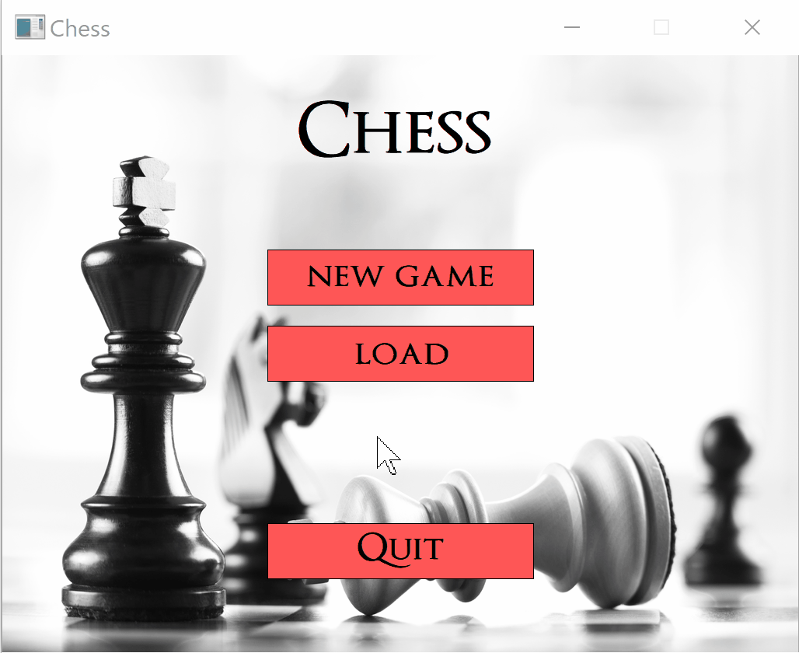

# Chess
<p align="center">
	  
</p>

The game is written in *C* and based on pure *SDL* ([Simple DirectMedia Layer](https://www.libsdl.org/)) for the graphical user interface. It consists of the following features:
* 2 game modes: player vs. player and player vs. computer. The computer moves are chosen using the [Minimax](https://en.wikipedia.org/wiki/Minimax) algorithm (which features [alpha-beta pruning](https://en.wikipedia.org/wiki/Alpha%E2%80%93beta_pruning)).
* 5 difficulty levels.
* View all valid moves for each piece, with indications of capture moves and threatened moves. 
* Undo previous moves.
* Save and load games.

### The Command-Line Interface
The game also features a command-line interface, as follows:
```
~# ./chess -c
 Chess
-------
Specify game settings or type 'start' to begin a game with the current settings:
> difficulty 1
Difficulty level is set to amateur
> print_settings
SETTINGS:
GAME_MODE: 1-player
DIFFICULTY: amateur
USER_COLOR: white
> start
Starting game...
8| R N B Q K B N R |
7| M M M M M M M M |
6| _ _ _ _ _ _ _ _ |
5| _ _ _ _ _ _ _ _ |
4| _ _ _ _ _ _ _ _ |
3| _ _ _ _ _ _ _ _ |
2| m m m m m m m m |
1| r n b q k b n r |
  -----------------
   A B C D E F G H
Enter your move (white player):
> move <2,E> to <3,E>
Computer: move pawn at <7,A> to <5,A>
8| R N B Q K B N R |
7| _ M M M M M M M |
6| _ _ _ _ _ _ _ _ |
5| M _ _ _ _ _ _ _ |
4| _ _ _ _ _ _ _ _ |
3| _ _ _ _ m _ _ _ |
2| m m m m _ m m m |
1| r n b q k b n r |
  -----------------
   A B C D E F G H
Enter your move (white player):
> move <1,F> to <4,C>
Computer: move pawn at <5,A> to <4,A>
8| R N B Q K B N R |
7| _ M M M M M M M |
6| _ _ _ _ _ _ _ _ |
5| _ _ _ _ _ _ _ _ |
4| M _ b _ _ _ _ _ |
3| _ _ _ _ m _ _ _ |
2| m m m m _ m m m |
1| r n b q k _ n r |
  -----------------
   A B C D E F G H
Enter your move (white player):
> move <1,D> to <5,H>
Computer: move pawn at <4,A> to <3,A>
8| R N B Q K B N R |
7| _ M M M M M M M |
6| _ _ _ _ _ _ _ _ |
5| _ _ _ _ _ _ _ q |
4| _ _ b _ _ _ _ _ |
3| M _ _ _ m _ _ _ |
2| m m m m _ m m m |
1| r n b _ k _ n r |
  -----------------
   A B C D E F G H
Enter your move (white player):
> move <4,C> to <7,F>
Checkmate! white player wins the game
```
### Usage
After compilation using ```make```, run the graphical game with ```./chess -g``` or the CLI with ```./chess -c```.